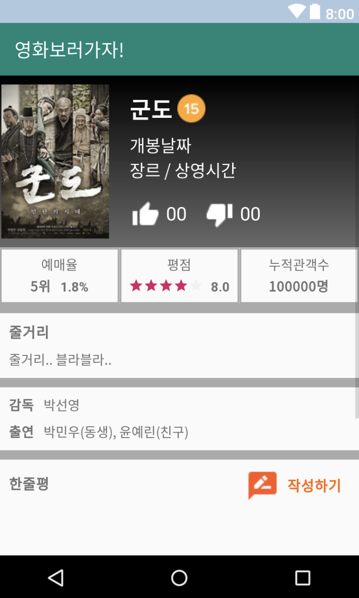
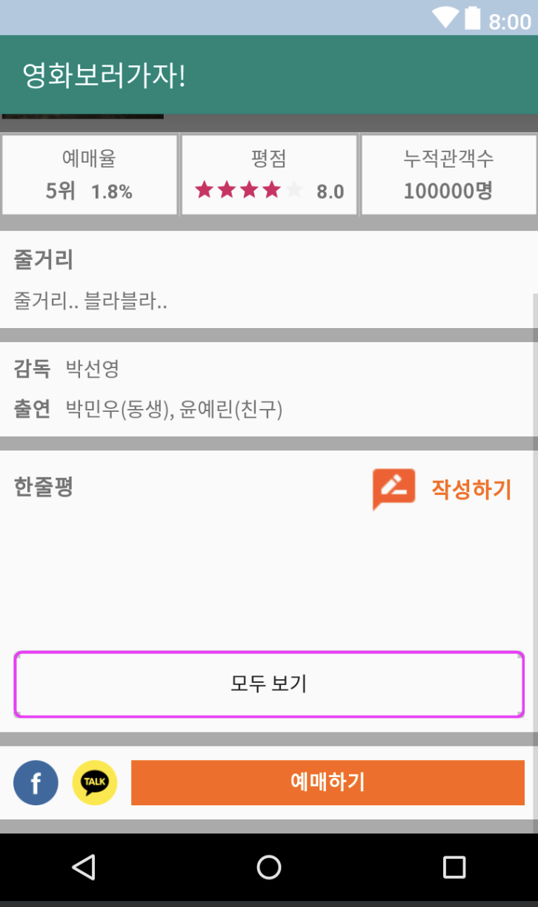
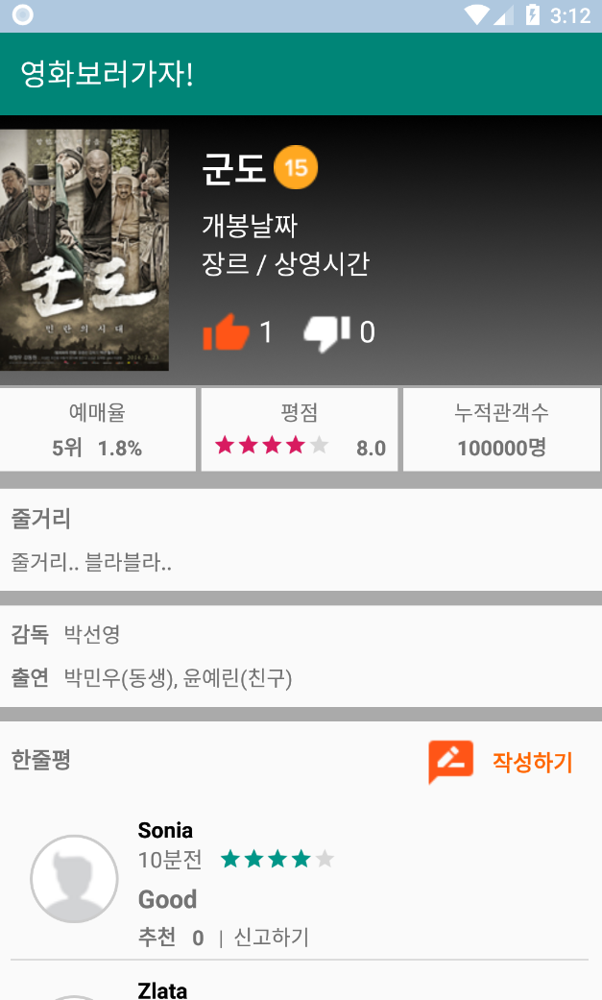
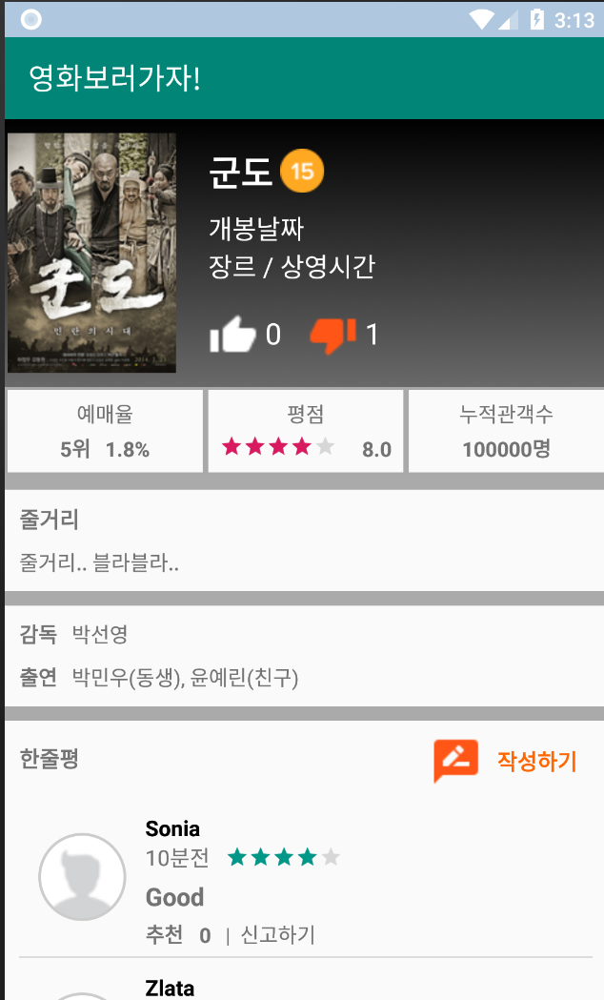
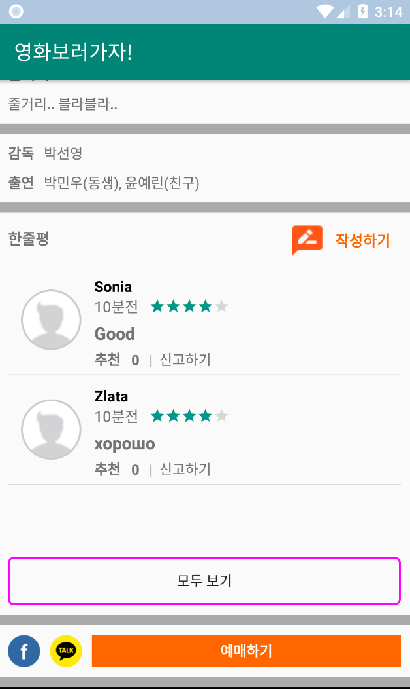

# 안드로이드 프로그래밍
### 네이버 부스트코스 안드로이드 강좌 수강 후 커리큘럼에 따라 진행한 프로젝트입니다.
#### <https://www.edwith.org/boostcourse-android>

---

### PJT1.영화상세 화면 만들기
공부 내용: 레이아웃과 기본 위젯들 
아래는 코드 실행 화면 
 

### PJT2.이벤트 처리와 리스트 뷰(인플레이터)
터치 이벤트를 사용하여, 좋아요, 싫어요 버튼 클릭 이벤트 생성하기(이벤트처리, 비트맵 버튼) 
인플레이션, 리스트뷰를 한줄평목록에 구현 
아래는 코드 실행 화면 
 